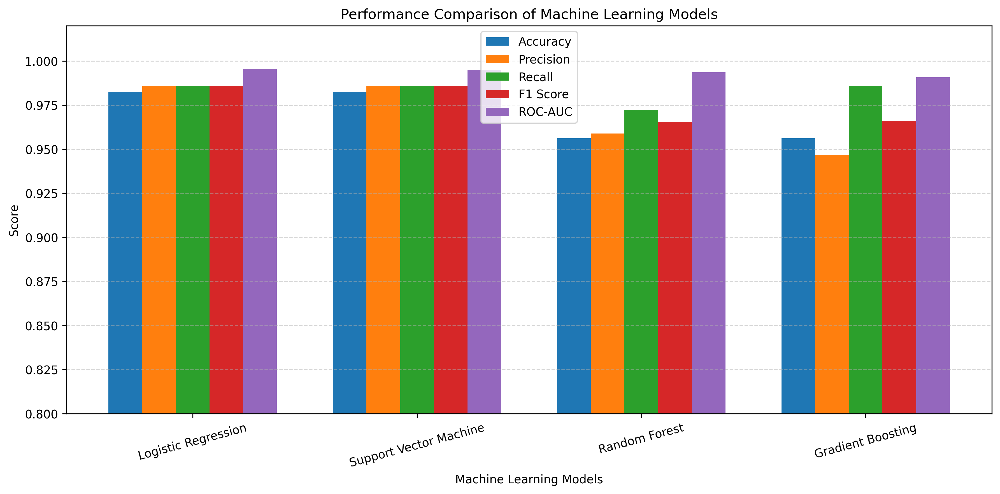
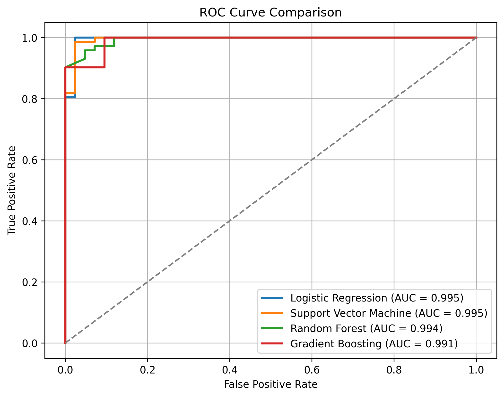
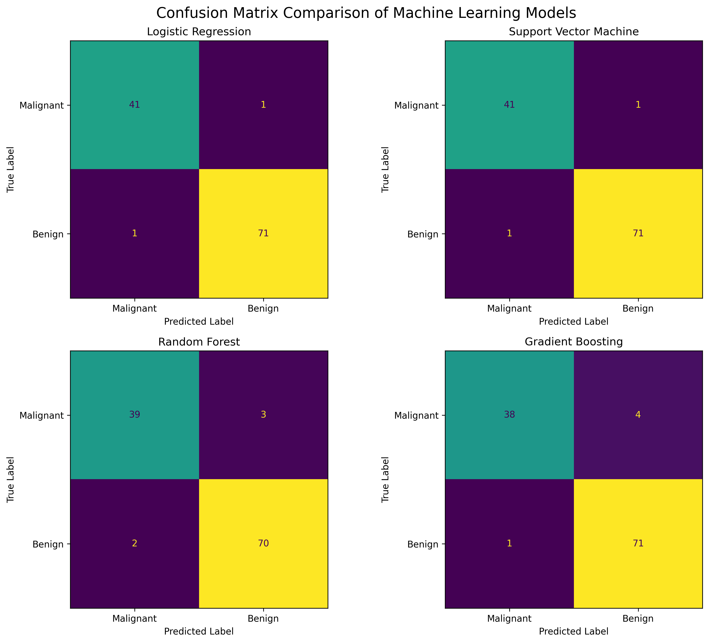
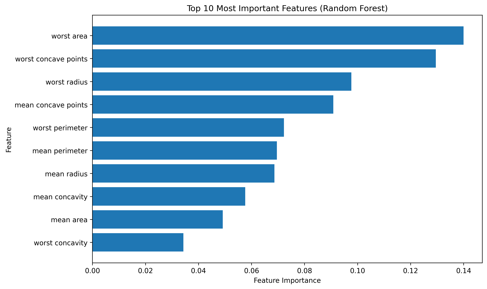

# 🩺 Breast Cancer Prediction using Machine Learning

A complete end-to-end **Machine Learning pipeline** for breast cancer classification using the **Breast Cancer Wisconsin Diagnostic Dataset** from Scikit-learn.

This project demonstrates a professional machine learning workflow, from exploratory data analysis and preprocessing to model training, evaluation, visualization, and model interpretation.

---

## 📌 Project Objectives

The primary objective of this project is to:

- Build a complete classical machine learning pipeline
- Explore and visualize the dataset
- Apply data preprocessing techniques
- Compare multiple classification algorithms
- Evaluate model performance using various metrics
- Interpret model predictions using feature importance

---

## 📂 Repository Structure

```text
breast-cancer-ml-pipeline
│
├── notebooks
│   └── breast_cancer_ml_pipeline.ipynb
│
├── reports
│   ├── figures
│   │   ├── model_comparison_metrics.png
│   │   ├── roc_curve_comparison.png
│   │   ├── confusion_matrix_comparison.png
│   │   └── feature_importance.png
│   │
│   └── model_comparison_metrics.csv
│
├── requirements.txt
└── README.md
```

---

## 📊 Dataset

**Dataset:** Breast Cancer Wisconsin Diagnostic Dataset

Source:
- Available directly through `sklearn.datasets`
- 569 patient samples
- 30 numerical features
- Binary classification problem

Classes:

- Malignant
- Benign

---

## ⚙️ Machine Learning Workflow

```
Load Dataset
      │
      ▼
Exploratory Data Analysis
      │
      ▼
Data Preprocessing
      │
      ▼
Train-Test Split
      │
      ▼
Feature Scaling
      │
      ▼
Model Training
      │
      ▼
Model Evaluation
      │
      ▼
Performance Comparison
      │
      ▼
Feature Importance
      │
      ▼
Save Model
```

---

## 🤖 Models Implemented

- Logistic Regression
- Support Vector Machine (SVM)
- Random Forest
- Gradient Boosting

---

## 📈 Evaluation Metrics

Each model is evaluated using:

- Accuracy
- Precision
- Recall
- F1-Score
- ROC-AUC
- Confusion Matrix

---

## 📊 Visualizations

The project includes:

- Class distribution
- Feature distributions
- Correlation heatmap
- ROC Curve comparison
- Confusion Matrix comparison
- Model performance comparison
- Feature Importance (Random Forest)

---

## 📷 Results

### Model Performance Comparison



---

### ROC Curve Comparison



---

### Confusion Matrix Comparison



---

### Feature Importance



---

## 🛠️ Technologies Used

- Python
- NumPy
- Pandas
- Matplotlib
- Seaborn
- Scikit-learn
- Joblib
- Google Colab
- GitHub

---

## 🚀 How to Run

### Clone the repository

```bash
git clone https://github.com/sabithamanoj/breast-cancer-ml-pipeline.git
```

### Install dependencies

```bash
pip install -r requirements.txt
```

### Launch the notebook

Open:

```
notebooks/breast_cancer_ml_pipeline.ipynb
```

Run all cells to reproduce the complete analysis.

---

## 📚 Future Improvements

Potential extensions include:

- Hyperparameter tuning using GridSearchCV
- Cross-validation
- SHAP explainability
- LIME explainability
- MLflow experiment tracking
- Flask API deployment
- Docker containerization
- CI/CD using GitHub Actions

---

## 👩‍💻 Author

**Sabitha Manoj**

Machine Learning • Deep Learning • Medical Imaging • Computer Vision

GitHub:
https://github.com/sabithamanoj

---

## ⭐ If you found this project useful

Please consider giving the repository a ⭐ to support the project.
